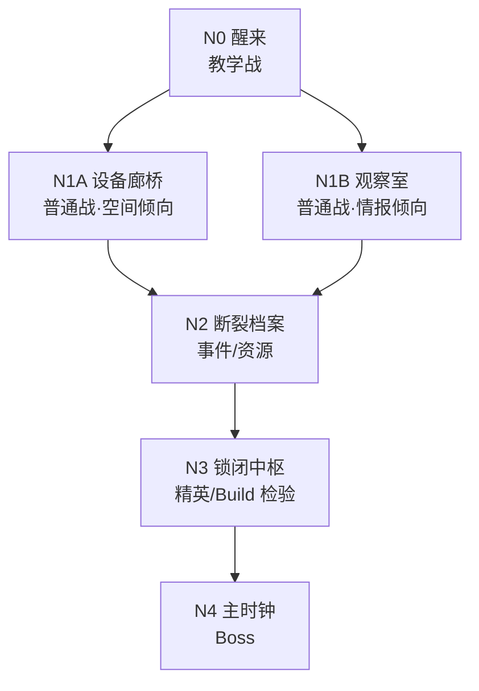
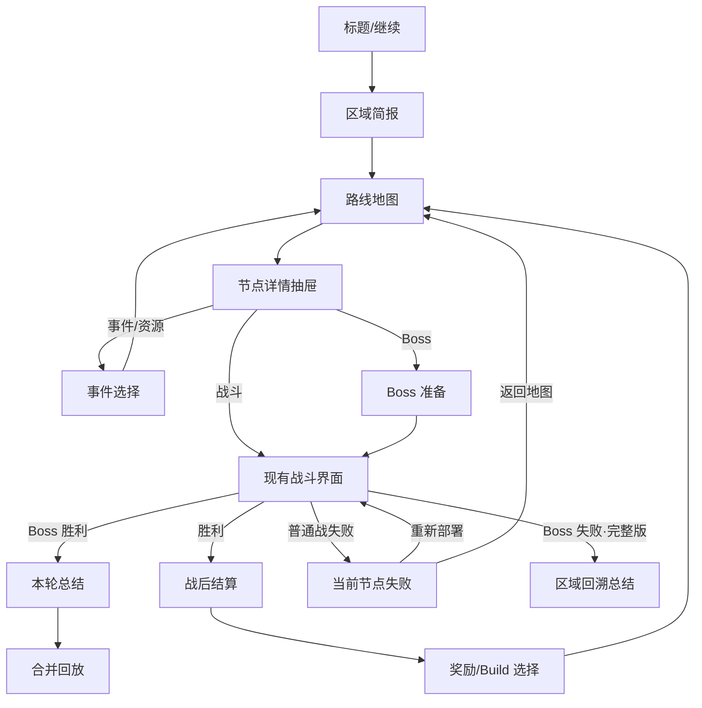

# M5.1 战斗外 UX 流程与页面线框

> 首版日期：2026-08-09
> 状态：六节点拓扑、路线地图、节点详情抽屉、战后结算/奖励、事件页面、Boss 准备页、普通战失败页与 Boss 失败页已锁定，总结页面待继续走查
> 目标画幅：390×844，兼容 360×800 与 430×932
> 关联决策：D-030、D-035、D-036
> 阶段边界：本文件只定义流程、页面状态与信息层级，不提前实现 `RunSession`

## 1. 旧 UI 稿的适用范围

`demo/art_concepts/08_ui_direction_laboratory_overlay.png` 至 `13_full_hud_max_complexity.png` 六张 UI 稿均完成于 2026-08-03—04，早于 2026-08-09 确认的 D-035 宏观框架。

- 08—12 号继续作为视觉探索记录，不再作为战斗外页面的产品结构依据。
- 13 号继续作为战斗画面、明亮实验室、近俯视战场与像素密度的视觉基准，但不定义路线、Build、事件或循环 UX。
- 14 号是 M5.0A 已验收的“时间控制台”战斗 HUD 基准，战斗外页面应复用其面板、按钮、图标与颜色语义。
- 15 号 `15_m51_route_map_temporal_fog_selected.png` 是 M5.1 已锁定路线地图视觉：明亮实验室实体地图承载地点感，纵向“过去→现在→未来”箭头承载时间结构，碎玻璃时间迷雾承载未知与跨轮知识。
- 16 号 `16_m51_node_detail_drawer_selected.png` 是 M5.1 已锁定节点详情抽屉视觉：约占屏幕下方三分之一，优先显示一句危险摘要、“危险 中”、可能产出与已知情报数量，同时保留大部分地图视野。
- 17 号 `17_m51_postbattle_reward_carousel_selected.png` 与 18 号 `18_m51_postbattle_result_phase_selected.png` 共同构成已锁定的战后同页两阶段视觉：第一阶段展开战斗记录，第二阶段把记录压缩为摘要条并升起中央奖励轮播。
- 19 号 `19_m51_event_contextual_preview_selected.png` 是 M5.1 已锁定事件页面视觉：以场景、短叙述和纵向选项构成通用事件外壳，仅在所选后果需要解释时展开对应类型的局部预览。
- 20 号 `20_m51_boss_preparation_selected.png` 是 M5.1 已锁定 Boss 准备页视觉：用孤身本体正面对峙巨大 Boss 建立进入最终战的尺度与情绪，下半区承载规则、情报、未知风险与当前 Build；图中规则数量只是代表状态，不是页面信息上限。
- 21 号 `21_m51_normal_failure_time_link_selected.png` 是 M5.1 已锁定普通战失败页视觉：以巨大的“战斗失败”和中央断裂的时间链接完成第一层情绪反馈，再用次级摘要说明当前节点重置、Build 与情报保留、待结算奖励丢失。
- 22 号 `22_m51_boss_failure_timeline_closed_selected.png` 是 M5.1 已锁定 Boss 失败页视觉：明亮的主时钟与区域碎片保留宏观尺度，跪地本体和“当前时间线已关闭”承担消极情绪，下半区用双栏区分随时间线关闭的内容与跨时间线保留的知识。
- 六张旧稿不删除，也不在其中重新选“战斗外最终稿”；M5.1 先按新框架完成流程与线框，再制作新的战斗外视觉候选。

## 2. 首个对外 Demo 的产品目标

### 2.1 测试对象与发布形式

- 第一目标受众：未接触项目、但有回合制战术或解谜游戏经验的玩家。
- 主要验证：玩家能否无讲解理解路线取舍、Build 会改变下一场战斗的解法、普通战与 Boss 失败代价不同，以及最终合并回放的意义。
- 第一轮发布采用私密/不公开的 Windows Godot 测试包，使用竖屏窗口与鼠标模拟触控，降低安装和设备适配变量。
- Android 触控包在流程稳定后补做；第一轮外测结论只证明信息与流程可理解，不替代真机触控验收。
- 单次完整体验目标 20—30 分钟；不是完整游戏单章时长样板。

### 2.2 一次体验必须形成的认知

1. 路线不是选关列表，而是在战力、情报与航程之间做取舍。
2. Build 不是单纯数值加成，而是为下一场战斗增加新的空间、行动或时间解法。
3. 普通战失败只需要解决当前节点；时间线中的死亡是工具，不等于宏观失败。
4. Boss 是当前路线与已知情报的综合检验。
5. 通关后的合并回放把多条时间线重新组织成一次“完美协作”，是本轮情绪高潮。

## 3. 首版路线结构

地图使用固定的六个物理节点；单次路线访问其中五个，避免为了展示系统而拉长 Demo。

节点职责：

| 节点 | 必须教会或检验的内容 | 主要产出 |
|---|---|---|
| N0 醒来 | 战斗基础、时间线与分身 | 第一次三选一 Build |
| N1A 设备廊桥 | 借助位移/地形解决战斗 | 空间模块或资源 |
| N1B 观察室 | 用已知历史与情报减少试错 | 时间模块或 Boss 情报 |
| N2 断裂档案 | 事件选择会改变后续可操作结果 | 情报、恢复或一次 Build 改造 |
| N3 锁闭中枢 | 当前 Build 是否真的形成新解法 | 最终强化与 Boss 入口权限 |
| N4 主时钟 | 路线、Build、情报与时间线编排的综合检验 | 本轮总结与合并回放 |

首版不加入商店、动态追兵、随机大地图或完整装备管理。

## 4. 最小连续流程

流程原则：

- 地图是唯一战斗外枢纽；完成奖励或事件后都返回地图，不建立多层基地菜单。
- 节点详情使用地图底部抽屉，不跳转到独立详情页，保留玩家对路线位置的记忆。
- 战后结算与奖励是同一页面的两个阶段，先解释发生了什么，再要求做选择。
- 普通战失败不出现“整轮损失”恐吓文案；Boss 失败才进入宏观回溯语义。
- 首个 Demo 不实现完整区域重置。为保证外测能走完整流程，Boss 失败暂提供“重新挑战”测试通道；正式章节接入历史重演后再切换为区域回溯。

## 5. 节点状态模型

节点不要做成一组互斥的五种皮肤。状态拆成四条可组合的轴，避免未来加入历史重演时推翻组件：

| 状态轴 | 值 | 页面表达 |
|---|---|---|
| 知识 | 未知 / 已知 | 未知只显示轮廓与风险范围；已知显示节点身份、主要危险和可能产出 |
| 进度 | 未访问 / 已访问 | 已访问显示结果印记与本轮选择，不用单纯变灰 |
| 历史 | 无 / 可历史重演 / 历史偏移 | 可重演显示橙色完整时钟；偏移显示金色裂纹、原因数量和“需重新介入” |
| 可达 | 锁定 / 可达 / 当前 | 锁定显示缺失条件；可达提供主操作；当前使用青色定位环 |

### 5.1 知识迷雾与隐藏分支

- 一周目默认“只揭示一步未来”：当前可达节点完整显示，直接后继节点只显示被薄雾覆盖的房间轮廓与未知标记。
- 距离超过一步的未来使用浓雾；浓雾不仅隐藏房间内容，也隐藏节点数量、分叉/汇合连线、节点类型和 Boss/精英轮廓，避免玩家从版式提前读出惊喜。
- 浓雾区保留可展开为左右两个房间的布局容量，但未揭示时不能通过两个对称阴影、双问号或分叉线暗示“这里有二选一”。
- 玩家抵达某节点后，才揭示其直接后继节点及必要连线；若后继是隐藏分支，两间房同时显形并成为新的路线选择。
- 跨轮保留的节点知识可以提前驱散对应迷雾；因此一周目的惊喜与二周目的“我知道未来”使用同一套组件，不做两套地图真相。
- 首个 Demo 的六节点拓扑保持不变；隐藏双房间分支只作为地图组件能力与未来章节布局容量预留，不在当前 Demo 额外增加节点。

历史重演的远期线框：

- 条件一致：主按钮为“历史重演 · 约 8 秒”，次按钮为“手动介入”。
- 条件改变：旧录像显示“历史偏移”，列出 1—2 个玩家可理解的原因，如“入口已封锁”“装备条件不同”；主按钮改为“重新介入”。
- 快速重演不会重新随机奖励；精确奖励结算和一致性判定留给 M5.2。

## 6. 页面线框规格

### S01 标题/继续

- 首要信息：游戏标题、当前存档的章节/区域、最近自动保存时间。
- 主操作：有存档时为“继续区域”；无存档时为“开始实验”。
- 次操作：“新区域”“设置”“制作信息”。覆盖存档前必须二次确认。
- 返回路径：系统退出；设置关闭后回到标题。
- 空状态：无存档时不显示灰色“继续”，直接替换为“开始实验”。

### S02 区域简报

- 首要信息：本区域目标、已知异常、预计节点数、当前坍缩总值。
- Build 区只展示当前三个模块槽，不提供复杂换装；首个 Demo 开始时三个槽均为空。
- 主操作：“进入区域”。
- 次操作：“查看已知情报”；返回标题放在左上角，不与主操作竞争。

### S03 路线地图

- 顶栏：区域名、当前进度 `2/5`、时序坍缩值、三个 Build 小图标。
- 中区：固定六节点地图、连线、当前路线与可达节点。
- 底部：默认显示一句当前目标；选择节点后升起 S04 节点详情抽屉。
- 地图不显示倒计时或追兵条。经过节点只推进路线位置，不因战斗用了更多回合或分身而缩短航程。
- 首次探索按第 5.1 节使用薄雾/浓雾分层；浓雾区不得泄露隐藏分支。已获得的跨轮知识可以提前显形已知房间。
- 返回：右上菜单可查看 Build、情报、设置或返回标题；返回标题自动保存。

### S04 节点详情抽屉

- 正式视觉采用 16 号选定稿的“决策速览”结构。抽屉默认约占 390×844 画幅下方 34%，顶部保留细拖拽柄，不用大号关闭叉遮挡信息；地图与当前选中节点继续可见。
- 已知可达节点：首行显示房间图标、名称与类型；中区用一句话概括关键机制，例如“击退会改变历史站位”；随后并列显示“危险 中”和“产出 空间模块”，危险等级必须同时使用文字与图标，不能只靠颜色。
- “危险”使用低/中/高三级可读等级，表示该房间对当前正常推进的综合挑战，不是精确胜率，也不随时序坍缩变成敌人强化倍率。
- 已知情报默认收成单行“查看已知情报 1条”，点按后在原抽屉内向上展开；进入按钮固定在最下方拇指热区，不随情报内容滚出屏幕。
- 未知可达节点：标题保持未知，只显示风险范围、可见环境线索和“进入调查”；完整奖励、敌人组合及房间身份继续隐藏。
- 锁定节点：在主操作位置明确写出缺失条件，不允许只显示无解释的灰色按钮。
- 可历史重演与历史偏移复用第 5 节的远期状态。
- 下滑抽屉或点按地图空白处即可关闭并回到同一地图位置；进入节点前不再增加一次确认弹窗。

### S05 战斗界面

- 直接复用 M5.0A—C 已验收战斗 HUD，不为战斗外流程重做战斗布局。
- 进入时只增加一张短促的节点/目标过场；过场可点按跳过。
- 暂不把宏观坍缩值塞入战斗常驻顶栏；可在暂停/状态页查看，避免与时间线数量混淆。

### S06 战后结算

- 第一阶段采用 18 号选定稿：顶部两阶段轨道固定显示“战斗记录 → 奖励选择”，当前阶段使用青色高亮，未进入阶段保持低亮。
- 展示顺序固定为目标完成、节点身份、使用时间线数、完成回合、快速通关条件、本节点关键结果、坍缩总变化与来源；关键结果使用橙色已验证历史语义。
- 坍缩使用中性“时序记录”表达，不使用红色倒计时；明确“影响长期世界状态，不提高本区域敌人强度”。
- 主操作“选择奖励”固定在底部拇指热区。点按后不跳页：战斗记录向上压缩为一条可重新展开的摘要，奖励轮播从下方升起。
- 失败时不进入奖励阶段。

### S07 奖励/Build 选择

- 第二阶段采用 17 号选定稿：中央卡完整显示，两侧各露出相邻奖励及类别，玩家可横向滑动或直接点按侧卡切换；三枚位置标记反馈当前选择。
- 每次提供三张卡，至少跨两个类别；中央卡固定显示类别、名称、改变的规则、将装入或替换的槽位，并使用正式模块插画作为视觉主体。
- 中央卡下方固定显示“战术例子”，首版使用两帧前后对照的小棋盘演示，不要求玩家只凭术语想象效果。
- 主按钮包含当前奖励名，例如“领取 极性反转”；这次点按就是领取确认，不再追加弹窗。若槽位已有模块，则同一位置直接显示旧→新并将按钮改为“替换并领取”。
- 已压缩的战斗记录摘要保持可点按展开；展开与收起不清除当前奖励选择。
- 允许一次“放弃并获得稳定资源”；首版不提供商店式刷新。
- 领取后短暂显示对应槽位的前后变化，再返回地图。

### S08 事件/资源

- 通用事件外壳采用“场景 → 标题/短叙述 → 已知情报 → 纵向选项”：先建立事件感，再让玩家比较可操作后果；不使用长段世界观对白。
- 选项必须明确改变至少一项：揭示节点、开启捷径、增加 Boss 选项、恢复资源、改变战斗初态或改造 Build。
- 已知信息解锁的特殊选项使用“情报”徽记；未满足选项显示具体缺失条件。
- 每个选项直接写出已知结果；选中项可在原位展开“后果预览”，但预览不是固定地图组件，也不取代事件场景。
- 地图变化使用局部路线预览，只显示本次揭示或改变的节点；更远未来仍由浓雾遮蔽，不泄露隐藏分支数量、房间类型或拓扑。
- Boss 规则变化使用规则前后对照；Build/战斗初态变化使用槽位差异或两帧战术示意；纯资源变化只显示图标与数值，不强行展示地图。
- 主按钮写入当前选项名并直接执行，不增加二次确认弹窗；执行后复用后果预览区显示结果，再返回地图。

### S09 Boss 准备

- 上半区以“小型本体正面对峙巨大 Boss”的场景作为情绪主画面，Boss 名称叠在场景边缘，不把准备页做成纯档案表。
- 下半区展示已知规则、未知规则数量、当前 Build 与可用情报；选定稿中的“1 条已知 + 2 条未知”只是首个 Demo 的代表状态，不是容量限制。
- 已知规则使用可扩展列表并按战术重要性排序；默认露出最关键的少量规则，更多规则可在同页展开或在独立滚动的简报区继续浏览，底部进入按钮始终固定。
- 未知规则只显示数量与浓雾摘要，不用多个问号卡占据与规则数量成正比的空间；规则被发现后移入已知列表。
- 对已发现的克制信息使用具体句子，不写抽象百分比，例如“它会追踪最新分身”；反制情报应贴近对应规则显示，未来允许一条规则关联多个反制条件。
- 当前 Build 使用紧凑槽位条，不随规则数量增长而挤压对峙场景；规则较多时优先让简报区滚动，而不是无限压缩字体或主画面。
- 主操作：“进入主时钟”；次操作：“返回地图”。
- 若缺少关键条件，只提示风险，不强制阻断高手首轮挑战。

### S10 当前节点失败

- 普通战只有在本场最后一个可用时间线结束且目标仍未完成时才进入此页；战斗中的单次本体死亡仍是可被利用的时间机制，不触发宏观失败页。
- 正式视觉采用 21 号选定稿：冻结并压暗刚才的战场作为背景，顶层使用巨大的“战斗失败”，中央以青紫时间部署导管断成两截和“时间链接已断开”承担主要视觉冲击。
- 不使用“时间线死亡”作为标题，避免把战斗内的主动死亡工具误读为节点失败；本页表达的是本次节点部署失败，而不是一条时间线结束。
- 次级状态摘要固定说明：当前节点将重置；当前 Build 与已知情报保留；待结算奖励已丢失。不要让地图状态或解释卡抢过断链主画面的第一视觉层级。
- 主操作“重新部署”，次操作“返回地图”；重新部署直接以相同战前状态进入当前节点，返回地图则保留本轮路线位置和已有知识。
- Boss 失败正式采用 22 号选定稿，不复用普通战的“战斗失败/时间链接已断开”标题：上半区以跪地本体、巨大主时钟和被卷走的区域房间表达整条路线终止，主标题固定为“当前时间线已关闭”。
- 消极感主要由人物姿态和“区域记录终止 · 将返回起点”“这条时间线不会继续，但留下的记忆仍在”等冷静系统文案承担；背景仍保持明亮、可读且有实验室层次，不做近乎停电的黑场。
- 下半区使用双栏对照：随时间线关闭的是当前路线、临时构筑与本轮资源；跨时间线保留的是节点知识、Boss 情报与已验证历史。首个 Demo 主操作仍为“重新挑战”，并明确标注“Demo 测试通道”；次操作为“返回区域起点”。
- 22 号概念图锁定构图与信息层级，不锁定其过高曝光。正式 UI 将主时钟与时间碎片辉光整体降低约 20%—30%，保持房间轮廓和青紫色层次，同时不得回退到上一版近乎全黑的关闭状态。

### S11 本轮总结/合并回放

- 总结内容：实际路线、关键选择、最终 Build、总坍缩变化、发现的永久知识与 Boss 结果。
- 情绪主操作：“观看合并回放”；功能次操作：“返回标题”。
- 首版合并回放只覆盖 Boss 获胜战，把所有时间线合成一次连续演出，提供 `1× / 3× / 跳过`；不制作全路线视频剪辑、自由镜头或复杂录像编辑器。
- 回放结束展示一句对本轮编排的总结，再允许重新观看或结束 Demo。

## 7. 首版 Build 范围

首版只做三个模块槽：空间、行动、时间各一格。同类新模块会替换旧模块，不做背包和装备管理。

| 类别 | 首版代表模块 | 产生的新解法 | M5.2 前需验证的规则风险 |
|---|---|---|---|
| 空间 | 极性反转：普通攻击可切换为拉近 1 格 | 把敌人拉离固定历史或拉入空洞/连锁位置 | 拉拽落点、碰撞与分身固定结果 |
| 行动 | 余步缓存：主要行动后可额外移动 1 格，每回合一次 | 允许攻击后脱离危险格或让下一条录像形成新路径 | 与“移动必须先于行动”的现有阶段规则冲突，需要显式额外动作语义 |
| 时间 | 回声错拍：每场战斗一次，使一名分身的本回合动作延后到本体之后、敌人之前 | 改变分身与本体的协作时序，而不是增加数值 | 优先级、录像 UI 和历史一致性成本最高，可在实现评估后换成更小效果 |

范围裁决：

- M5 首个 Demo 最少实现其中两个类别，并保证奖励会改变下一场战斗的解法；三类都在 UI 和数据结构中预留。
- 第二武器延期；首版用模块改变现有攻击与时序，避免同时引入换武器教学。
- 监视延期；其当前时间线与分身录像语义已定义，但不是首个战斗外闭环的必要条件。
- 完整背包、模块升级树、品质颜色和随机词条延期。

## 8. 坍缩值显示

- 名称统一为“时序坍缩”，数值可见但不常驻战斗 HUD。
- 地图顶栏显示当前总值与裂纹图标；点击后说明来源及长期影响。
- 战后结算只显示本战增量和来源，如“死亡创建时间线 +2、主动固化 +1”。
- 本轮总结显示累计变化与低坍缩挑战结果。
- 禁止把坍缩画成区域内追兵倒计时、失败计量条或敌人强化倍率；这会与 D-007/D-035 冲突。

## 9. 战斗内外共享视觉语言

- 青：当前玩家、可达节点和主操作。
- 紫：分身、录像与历史重演。
- 橙：固定历史、已验证解法和普通警示。
- 红：确定伤害、不可逆危险和当前失败原因。
- 金：清醒、历史偏移和脱离固定历史。
- 面板与按钮复用 M5.0A 的完整底板、窄边、弱光、斜角和独立图标，不重新引入旧九宫格框或白热高光。
- 重要状态同时使用图标、短文字和轮廓；节点状态不能只靠颜色。

## 10. M5.1 门禁

进入 M5.2 前必须完成：

1. 用 S01—S11 串成可点击的低成本竖屏流程。
2. 一次无讲解走查能从标题完成 N0、路线选择、事件/资源、精英、Boss 与总结。
3. 普通战失败、锁定节点、无存档、奖励放弃、Boss 返回和 Boss 失败均有明确出口。
4. 地图至少能展示未知、已知、已访问、可历史重演和历史偏移；后两者可以是远期只读状态。
5. 360×800、390×844、430×932 三种比例无遮挡与误触风险。
6. 用户确认本文件的路线结构、页面链路、Build 范围、坍缩显示与延期项后，再开始 `RunSession` 数据设计。
