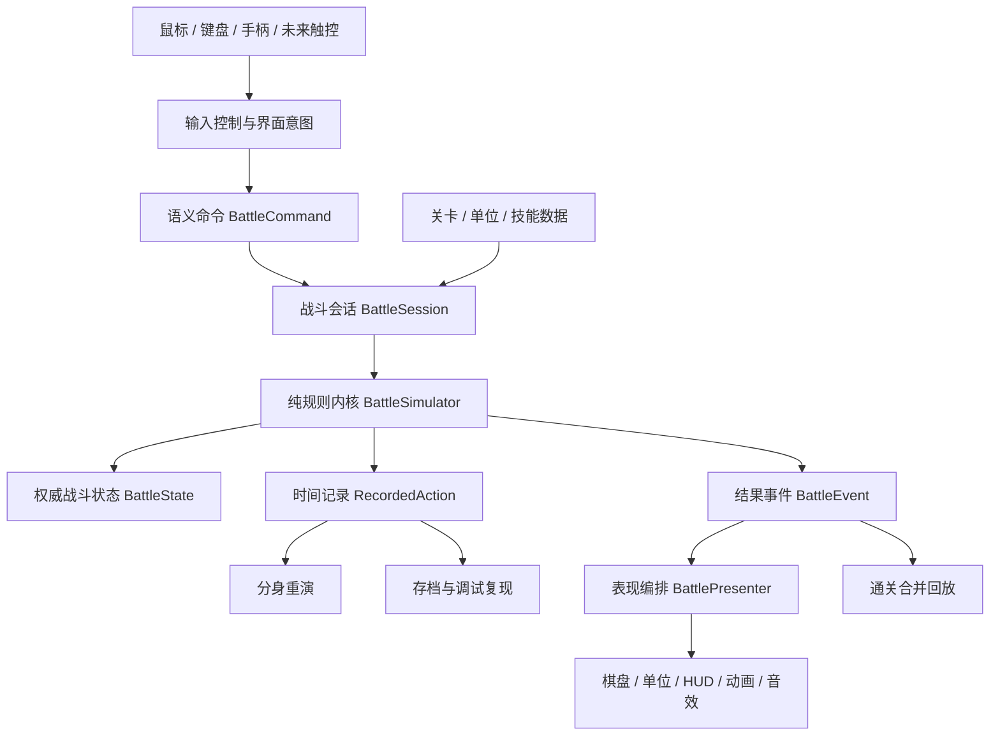

# Timeloop 正式版项目架构 v1（Godot）

> 状态：已确认的首版架构基线
>
> 日期：2026-08-02
>
> 适用范围：Godot 正式工程、战斗纵向切片、后续内容和素材生产
>
> 关联文档：《项目 TODO 与设计决策》D-020

## 1. 架构目标

正式版的首要目标不是尽快复制 H5 的外观，而是建立一个可以长期扩展、稳定回放、方便替换美术和 UI 的工程底座。

必须满足：

- 战斗规则不依赖动画播放速度、画面节点或输入设备。
- 分身录像、敌人历史、存档和通关回放使用同一套可序列化时间记录。
- 同样的关卡、初始种子和玩家输入必须得到同样的结果。
- 美术、UI、音效和动效能够逐步替换，不要求重写战斗规则。
- 关卡、单位、技能和数值尽量以数据配置，不散落在场景脚本里。
- 当前优先 PC，但输入与界面结构保留手柄和未来触控适配能力。
- 单个模块可以独立测试，错误能够定位到规则、数据或表现层，而不是依赖人工完整游玩才能发现。

## 2. 当前阶段与范围

项目从“网页玩法验证”进入“正式版预制作 / Godot 战斗纵向切片”。

- H5 六关版本作为玩法参考、规则对照和关卡参数来源保留。
- H5 原则上冻结功能，只修阻断试玩或会误导规则理解的问题。
- Godot 是后续正式开发的唯一主工程。
- 第一阶段只建立战斗底座，不同时制作完整肉鸽、Boss、剧情、商店和正式美术。
- 首批迁移第 1 关和第 5 关：第 1 关验证最小循环，第 5 关压测复杂空间与敌人历史规则。

## 3. 总体分层



### 3.1 规则内核 `core`

职责：

- 保存权威战斗状态。
- 验证并执行移动、攻击、固化、结束回合等命令。
- 计算可达格、合法目标、伤害、击退、死亡、扰动、敌人意图和时间线切换。
- 生成确定性的时间记录与结果事件。
- 提供预览查询，例如可移动范围、分身终点、火线和敌方历史目标。

约束：

- 使用普通 GDScript 数据对象；核心对象不继承 `Node`。
- 不引用场景节点、贴图、动画、音频、Tween 或 UI。
- 不使用 `await`、计时器或真实帧时间决定规则。
- 不直接读取鼠标坐标或按键。
- 不依赖 `Dictionary` 的遍历顺序决定结算顺序。
- 所有随机数只通过战斗会话持有的固定种子随机源产生，并保存种子与调用序号。

### 3.2 应用编排 `app`

职责：

- 创建和结束一场战斗。
- 把界面发来的语义命令交给规则内核。
- 管理命令队列、战斗快照、录像保存和版本迁移。
- 控制当前处于玩家输入、分身播放、敌人执行、结算或暂停中的哪个应用阶段。
- 向表现层发布一批有确定顺序的结果事件。

`BattleSession` 是单场战斗的唯一入口和状态所有者。战斗状态不放进全局单例，退出战斗后会话即可完整销毁。

### 3.3 表现层 `presentation`

职责：

- 将逻辑格坐标映射到等距 2D 屏幕坐标。
- 显示地图、单位、分身、意图、火线、时间排斥、空洞、扰动和 HUD。
- 按事件队列播放移动、攻击、受击、击退、死亡、碎裂、固化消失和音效。
- 支持正常、加速、瞬时三种播放模式；以后可扩展暂停、逐步播放和跳过。
- 将点击、键盘焦点或手柄选择翻译成同一种语义命令。

约束：

- 单位 View 只展示状态，不自行扣血、寻路或判断死亡。
- 动画结束只代表“可以继续展示下一事件”，不能反过来决定规则结果。
- HUD 不直接修改 `BattleState`。
- 所有危险提示同时使用颜色和形状/图标，不只依赖色相区分。

### 3.4 内容数据 `content`

正式工程优先使用 Godot 自定义 `Resource` 编辑内容，运行时通过稳定字符串 ID 关联。

首批数据类型：

- `LevelDefinition`：地图尺寸、出生点、墙、空洞、目标、命数和规则开关。
- `UnitDefinition`：基础属性、阵营、移动方式、占格和表现资源 ID。
- `AbilityDefinition`：范围、目标规则、伤害、位移和资源消耗。
- `EnemyDefinition`：单位数据与确定性 AI 策略 ID。
- `EncounterDefinition`：关卡中生成哪些单位、初始位置和胜负条件。

资源之间不保存易失效的场景节点引用。存档和录像只保存稳定 ID、数值和版本号。

### 3.5 基础设施 `infrastructure`

职责：

- 存档、设置和录像的序列化与版本迁移。
- 内容注册和数据校验。
- 音频、场景切换、日志、崩溃复现信息等工程服务。
- 调试菜单和开发构建开关。

全局单例保持最少，只允许放跨场景服务，例如：

- `SceneRouter`
- `SaveService`
- `SettingsService`
- `ContentRegistry`

禁止建立同时管理战斗、角色、UI、音效和存档的巨型 `GameManager`。

## 4. 三类核心记录

正式版必须区分“玩家想做什么”“过去实际记录了什么”“当前世界发生了什么”。

### 4.1 `BattleCommand`

来自玩家或调试工具的语义输入，例如：

- 移动到某格。
- 对某格使用某技能。
- 结束回合。
- 固化当前时间线。

它不包含动画信息，也不保证一定合法。

### 4.2 `RecordedAction`

时间线成立后保存的权威录像动作，包括：

- 稳定动作 ID 与执行者 ID。
- 回合、阶段、单位顺序、移动步和反应序号。
- 绝对起点、终点、朝向、目标格或目标区域。
- 原时间线已经确定的命中、伤害、击退方向和其他固定结果。
- 动作结束原因：正常、死亡中止或主动固化。

分身只读取 `RecordedAction`，不重新读取玩家输入，也不重新运行目标选择 AI。

### 4.3 `BattleEvent`

规则内核对当前世界完成一次结算后产生的具体结果，例如：

- `UnitMoved`
- `AttackPerformed`
- `DamageApplied`
- `UnitPushed`
- `ActionInvalidated`
- `EnemyDisturbed`
- `UnitDied`
- `TimelineEnded`
- `BattleWon`

表现层按照事件顺序播放动画。通关合并回放保存完整事件流或由稳定记录重新生成事件流。

### 4.4 快照与未来悔棋

当前玩法仍不开放单步悔棋，但正式架构必须允许未来添加，而不重写战斗内核。

- `BattleSession` 在每个被接受的玩家命令执行前创建 `BattleCheckpoint`。
- 检查点保存完整权威状态，包括当前录像、敌人历史、场景对象、待结算数据、随机源状态和事件序号。
- 悔棋只发生在稳定的命令边界，不回滚正在结算到一半的原子动作。
- 恢复时直接替换权威状态、丢弃尚未播放的旧事件，并要求表现层从新状态整体同步；不倒放移动或攻击动画。
- 检查点包含原命令，因此未来可以继续扩展重做、战斗复现和崩溃恢复。
- 允许回到哪一层由玩法策略控制：可以只允许撤销移动，也可以允许撤销本回合乃至当前时间线；架构本身不写死范围。
- 已成立的更早时间线默认视为提交边界，不允许普通悔棋修改；若未来设计特殊时间能力，应走明确的规则突破流程。

因此，“当前禁止悔棋”是玩法规则，不是技术限制。

## 5. 时间与坐标约定

### 5.1 逻辑时点

所有需要进入录像的动作使用结构化时点，不使用动画秒数：

`turn_index / phase / actor_order / step_index / reaction_index`

- `turn_index` 从 1 开始，便于与玩家界面一致。
- `phase` 使用固定枚举，不使用任意字符串决定顺序。
- `actor_order` 明确旧分身、新分身、本体和敌人的执行优先级。
- `step_index` 定位移动中的具体一步。
- `reaction_index` 处理监视等插入动作。

### 5.2 格坐标

Godot 正式工程统一使用 `Vector2i(x, y)`：

- `x` 是列，从左向右增加。
- `y` 是行，从上向下增加。
- H5 的 `{row, col}` 迁移时转换为 `Vector2i(col, row)`。
- 规则内核只认逻辑格；等距投影由 `GridMapper` 单独负责。

这一约定避免规则代码混入屏幕像素坐标，也避免后续镜头、缩放或棋盘素材变化影响寻路。

## 6. Godot 场景结构

首版战斗场景建议：

```text
BattleScreen
├── BattleWorld
│   ├── TerrainLayer
│   ├── HazardLayer
│   ├── PreviewLayer
│   ├── UnitLayer
│   └── VfxLayer
├── BattleCamera
├── BattlePresenter
├── BattleInputController
└── BattleHUD
    ├── MissionPanel
    ├── TimelinePanel
    ├── PhaseBanner
    ├── UnitInspector
    ├── ActionBar
    └── ModalLayer
```

- 地形和危险区域可以使用多个地图层。
- 单位是独立场景实例，便于动画、受击反馈和皮肤替换。
- 预览层单独绘制移动范围、攻击格、分身路径和敌人意图。
- VFX 与单位状态分离，销毁特效不能销毁权威单位数据。
- HUD 使用 `Control` 锚点和容器布局，按照参考分辨率设计并适配不同宽高比。

## 7. 推荐目录

```text
game/
├── project.godot
├── core/
│   ├── model/
│   ├── commands/
│   ├── events/
│   ├── systems/
│   └── queries/
├── app/
│   ├── battle/
│   ├── replay/
│   └── run/
├── presentation/
│   ├── battle/
│   ├── ui/
│   ├── vfx/
│   └── audio/
├── infrastructure/
│   ├── save/
│   ├── content/
│   └── debug/
├── content/
│   ├── levels/
│   ├── encounters/
│   ├── units/
│   └── abilities/
├── assets/
│   ├── art/
│   ├── ui/
│   ├── audio/
│   └── fonts/
└── tests/
    ├── unit/
    ├── scenarios/
    └── fixtures/

source_assets/
├── art/
├── ui/
└── audio/
```

- `game/assets` 只放 Godot 运行时真正使用的导出素材。
- `source_assets` 放 Aseprite、PSD、工程音频等源文件；大文件增多前评估 Git LFS。
- 测试夹具保存从 H5 六关转换来的关卡和动作序列。

## 8. 美术、UI 与动效接口

### 8.1 美术不阻塞规则开发

第一轮使用几何灰盒和统一占位图，但从一开始保留正式素材接口：

- 每种单位使用稳定的表现资源 ID，不在规则里写贴图路径。
- 地形逻辑类型和地形皮肤分离；同一种墙可以更换实验室、废墟等外观。
- 动作名稳定，例如 `idle`、`move`、`attack`、`hit`、`death`、`timeline_break`、`crystallize_end`。
- 特效只消费事件和位置，不读取或改变规则状态。

在正式绘制大量素材前，先完成一个“美术基准格”：确定等距格比例、角色脚底锚点、角色最大外扩范围、阴影方式和像素缩放策略。基准格未确认前，不批量生产角色和地块。

### 8.2 UI 先做信息架构，再做皮肤

首轮先确认以下信息是否在正确时机出现：

- 当前是已知时间、未知时间还是扰动时间。
- 每个分身本回合与下一回合的路径、终点和火线。
- 敌方历史移动终点、攻击目标和顺序。
- 本体当前可以移动、攻击、固化还是结束回合。
- 动作为何无效、角色为何死亡。

确认布局和操作流程后，再统一制作正式面板、按钮、图标、字体和故障效果。CRT/glitch 只能作为气氛层，不能遮挡格子、伤害数字和危险预告。

### 8.3 素材交付约定

用户可以直接提供：

- PNG、SVG、Aseprite 或 PSD 美术源文件。
- WAV、FLAC 或高质量 OGG 音频。
- 参考图、草图、录屏和文字反馈。

每项素材至少说明：用途、对象 ID、期望场景和是否可以裁切/调色。未说明时按“源文件保留，导出副本可技术调整”处理。

运行时文件使用小写英文和下划线，例如：

- `player_attack_01.png`
- `guard_move.ogg`
- `icon_timeline_disturbed.svg`

视觉上不能只靠文件名区分的变体，额外保留清楚的预览图或素材清单。

## 9. 测试架构

### 9.1 规则单元测试

无需打开完整游戏画面即可验证：

- 寻路和合法终点。
- 分身占位排斥。
- 固定目标格攻击与友军伤害。
- 击退、空洞死亡和位移失败。
- 历史移动撞击。
- 扰动在下一回合清醒。
- 死亡、固化、时间线重置和最后一命失败。

### 9.2 场景复现测试

把一组初始状态和命令序列保存为测试夹具，执行后比较最终状态摘要与事件摘要。首批至少覆盖 H5 第 1 关和第 5 关。

### 9.3 表现冒烟测试

自动或人工检查：

- 每种事件都有可见反馈。
- 加速与瞬时播放不会漏掉最终状态同步。
- 切换分辨率后棋盘和关键 HUD 不被裁切。
- 暂停、退出和重开不会留下旧战斗节点或重复信号连接。

## 10. 我们的协作方式

### 10.1 每轮工作流程

1. 从项目记忆恢复上下文，明确本轮唯一主要目标。
2. 先写验收标准；涉及规则变化时更新设计决策。
3. 先实现并测试规则，再接表现层。
4. 用占位素材形成可玩版本，不等待正式美术。
5. 用户实际试玩，优先反馈“哪里看不懂、哪里不像预期、哪里节奏不对”。
6. 修改后完成自动测试与人工冒烟测试。
7. 更新项目记忆、提交并推送 `origin/main`。

### 10.2 用户最有价值的配合

- 对玩法和体验做最终取舍，例如“这个失败是否公平”“这条信息是否该提前显示”。
- 在真实 Godot 构建中试玩，而不只看截图。
- 提供或选择视觉、音频参考，确认风格基准后再扩量。
- 反馈时尽量附带关卡、时间线、回合和操作步骤；录屏优先。
- 对新增大系统先确认目标，不需要提前决定代码实现方式。

### 10.3 Codex 的主要职责

- 维护架构、代码、测试、数据转换和文档一致性。
- 提前指出会影响录像确定性、存档兼容或素材返工的设计风险。
- 把用户提供的素材接入表现层，并维持命名、导入和锚点规范。
- 每轮交付可运行结果、验证结果和明确的下一步，而不是只交付零散脚本。

## 11. 开发里程碑

### M0：架构骨架

- 建立正式目录和基础类。
- 实现 `BattleCommand`、`BattleState`、`RecordedAction`、`BattleEvent` 的最小版本。
- 实现 `BattleCheckpoint`、命令前快照和回滚接口，但不在正式 UI 开放悔棋按钮。
- 建立无画面规则测试入口。
- 建立关卡资源与校验器。

### M1：第 1 关纵向切片

- 完成移动、相邻攻击、敌人实时 AI、死亡、时间线重置、分身重演和胜负。
- 使用占位等距棋盘、单位和基础 HUD 完整游玩。
- 单位沿规则路径逐格播放；提供分身火线、已知敌人意图和时间线切换基础弹窗。
- 行动记录可以保存、重新加载并复现。

### M2：第 5 关架构压测

- 加入固化、固定敌人历史、击退、空洞、历史撞击和扰动清醒。
- 在 M1 基础预览上完善分身终点、复杂移动、击退落点和无效动作原因。
- 完成正常、加速和瞬时播放。

### M3：六关迁移与视觉基准

- 将其余四关迁入 Godot 数据层。
- 用统一测试夹具验证 H5 和 Godot 的关键结果一致。
- 确认一套战斗画面与 UI 视觉基准，再开始正式素材扩量。

### M4：对外体验 Demo

- 在 M3 试玩结论基础上确定教学、普通战、Boss、Build 和宏观节点范围。
- 这时再决定监视、第二种武器和通关合并回放进入哪个版本。

## 12. 当前明确不做的事

- 不把 H5 的 DOM、异步等待和全局状态逐行翻译为 GDScript。
- 不在规则内核中调用动画或访问场景树。
- 不在美术基准确定前批量生产整套正式素材。
- 不为尚未验证的完整肉鸽、Meta、Boss 劫持分身提前搭建复杂框架。
- 不为了“未来也许会用”引入大型插件或过度抽象。
- 不允许 UI、单位节点和特效各自保存一份互相竞争的战斗真相。

## 13. 首轮开工顺序

1. 建立 M0 目录、核心数据结构和测试入口。
2. 把 H5 第 1 关转换成 `LevelDefinition` 测试数据。
3. 实现第 1 关所需纯规则闭环并通过场景复现测试。
4. 接入最小 Godot 棋盘、输入和 HUD。
5. 用户试玩第 1 关 Godot 版本。
6. 再以第 5 关检验架构，而不是先迁移全部六关。

## 14. 当前实现状态（2026-08-03）

- M0 正式目录和核心脚本已经建立。
- 已实现 `BattleCommand`、`BattleState`、`RecordedAction`、`BattleEvent`、`BattleCheckpoint`、`BattleSimulator` 和 `BattleSession` 的最小版本。
- `BattleSession` 采用候选状态结算：合法命令整体提交，非法命令不会污染权威状态。
- 已实现命令前检查点、命令级撤销、撤销提交边界与检查点数量上限。
- 撤销会恢复单位状态、当前录像、命令序号、敌人历史容器和随机源状态，并发出 `state_restored` 要求表现层整体同步。
- 检查点已经通过 JSON 往返恢复测试。
- H5 第 1 关已转换为 `first_echo.tres`，并通过关卡数据校验。
- 第 1 关纯规则闭环已经完成：移动、相邻攻击、固定伤害、确定性敌人实时 AI、敌方阶段、回合推进、死亡、固定敌人历史、时间线切换、分身重演、即时胜利和最后一命失败。
- 死亡时间线会成为分身记录；获胜时间线也会进入合并回放数据；最后一命失败不会错误生成不可使用的分身。
- 第 1 关端到端测试已经复现 T1 攻击后死亡、T2 分身攻击与当前本体补刀胜利的完整流程。
- 第 1 关第一份可见纵向切片已经完成：占位等距棋盘、鼠标点格操作、基础 HUD、战斗日志、时间线按钮和三档播放速度已接入项目主场景。
- `BattleEventPlayer` 严格顺序播放规则事件，`BattleBoardView` 只负责显示和交互，事件结束后从 `BattleState` 整体同步，不直接修改规则状态。
- 真实 Godot 1280×720 渲染检查未发现棋盘或关键 HUD 裁切。
- 用户完成第 1 关首轮试玩，确认点击、时间线理解、分身辨识和动画节奏达到当前灰盒要求。
- 根据试玩反馈完成 M1.5：`unit_moved` 携带显式格子路径，本体、分身和敌人均逐格播放；未来逐格陷阱可以通过规则层截断路径或插入有序事件扩展。
- `turn_started` 提供分身动作预览和已知敌人意图；棋盘显示紫色分身路径/火线、红色已知攻击格和橙色历史移动终点，未知时间不泄露敌人实时 AI。
- 时间线结束改为遮罩弹窗，当前为占位皮肤，正式视觉可在表现层独立替换。
- 界面端到端冒烟测试通过 12 项检查；核心无画面测试增至 76 项，新增单格/多格路径与回合预览数据断言。
- M1 剩余工作是用户复验表现修正，以及为完整行动记录补齐独立保存/重新加载入口；复验通过后进入 M2 第 5 关架构压测。
